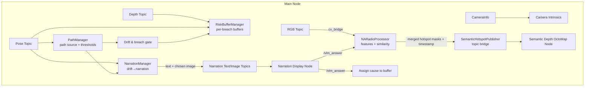
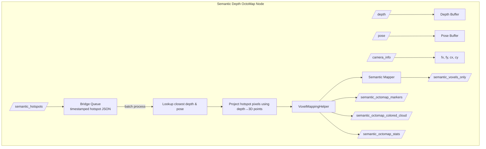

## Resilience: Getting Started and System Overview

This guide helps a new user get familiar with the Resilience system: how to configure topics (RGB, depth, pose), how the path is loaded (JSON file or external topic), and how the nodes fit together at a high and low level.

### What this system does (at a glance)
- **Detects path drift** against a nominal/global path and narrates the event.
- **Captures context** (images/pose/depth) into per-breach buffers.
- **Queries a VLM** with the narration image to get a concise cause word (published as `vlm_answer`).
- **Builds a semantic voxel map** by projecting VLM hotspot masks through depth into 3D.


## 1) Configuration: Topics and Paths

All key topics are defined in config files and can be changed without touching code.

### 1.1 Main pipeline topics (RGB, Depth, Pose, Camera Info)
These are read by the main node from `config/main_config.yaml`.

- **RGB Image**: `topics.rgb_topic` (default: `/robot_1/sensors/front_stereo/right/image`)
- **Depth Image**: `topics.depth_topic` (default: `/robot_1/sensors/front_stereo/depth/depth_registered`)
- **Pose**: `topics.pose_topic` (default: `/robot_1/sensors/front_stereo/pose`)
- **Camera Info**: `topics.camera_info_topic` (default: `/robot_1/sensors/front_stereo/right/camera_info`)
- Optional I/O for narration and similarity outputs are also under `topics.*`.

Example snippet from `config/main_config.yaml`:
```yaml
topics:
  rgb_topic: "/robot_1/sensors/front_stereo/right/image"
  depth_topic: "/robot_1/sensors/front_stereo/depth/depth_registered"
  pose_topic: "/robot_1/sensors/front_stereo/pose"
  camera_info_topic: "/robot_1/sensors/front_stereo/right/camera_info"
  # outputs
  drift_narration_topic: "/drift_narration"
  narration_text_topic: "/narration_text"
  narration_image_topic: "/narration_image"
  vlm_answer_topic: "/vlm_answer"
```

### 1.2 Mapping topics (Depth, Pose, Camera Info, Semantic Hotspots)
These are read by the semantic mapping node from `config/mapping_config.yaml`.

- **Depth Image**: `topics.depth_topic` (default: `/robot_1/sensors/front_stereo/depth/depth_registered`)
- **Camera Info**: `topics.camera_info_topic` (default: `/robot_1/sensors/front_stereo/left/camera_info`)
- **Pose**: `topics.pose_topic` (default: `/robot_1/sensors/front_stereo/pose`)
- **Semantic Hotspots (from bridge)**: `topics.semantic_hotspots_topic` (default: `/semantic_hotspots`)

Example snippet from `config/mapping_config.yaml`:
```yaml
topics:
  depth_topic: "/robot_1/sensors/front_stereo/depth/depth_registered"
  camera_info_topic: "/robot_1/sensors/front_stereo/left/camera_info"
  pose_topic: "/robot_1/sensors/front_stereo/pose"
  semantic_hotspots_topic: "/semantic_hotspots"
  semantic_octomap_markers_topic: "/semantic_octomap_markers"
  semantic_octomap_stats_topic: "/semantic_octomap_stats"
  semantic_octomap_colored_cloud_topic: "/semantic_octomap_colored_cloud"
  semantic_voxels_only_topic: "/semantic_voxels_only"
```

### 1.3 Path loading modes (defined in `config/main_config.yaml`)
The path can be sourced in two ways and is declared in the `path_mode` section.

- **Mode A: JSON file (`json_file`)**
  - Loads nominal path from a JSON file on disk
  - Publishes it to a global path topic
  - Uses calibrated thresholds from JSON (if present)

- **Mode B: External planner (`external_planner`)**
  - Listens to a global path topic for an externally provided path
  - Non-blocking wait; starts when the first path arrives
  - Thresholds are configured in YAML since calibration JSON is not present

Example `json_file` mode:
```yaml
path_mode:
  mode: "json_file"
  global_path_topic: "/global_path"
  json_file:
    nominal_path_file: "adjusted_nominal_spline.json"  # relative to the package assets
    publish_rate: 1.0
```

Example `external_planner` mode:
```yaml
path_mode:
  mode: "external_planner"
  global_path_topic: "/global_path"
  external_planner:
    require_path: true
    timeout_seconds: 30.0
    thresholds:
      soft_threshold: 0.10
      hard_threshold: 0.25
```


## 2) How the nodes interact (high level)

```mermaid
graph LR
  A[Resilience Main Node<br/>resilience/scripts/main.py] -->|Publishes narration text+image| B[Narration Display Node<br/>resilience/scripts/narration_display_node.py]
  B -->|Publishes VLM Answer (String)| A
  A -->|Publishes Semantic Hotspots (JSON via bridge)| C[Semantic Depth OctoMap Node<br/>resilience/scripts/depth_octomap_node.py]
  A -->|Subscribes RGB/Depth/Pose/CameraInfo| D[Sensors]
  C -->|Subscribes Depth/Pose/CameraInfo| D
  E[External Planner or JSON File] -->|Global Path Topic or JSON| A
  C -->|Publishes semantic voxels/markers/stats| F[RViz / Consumers]
```

- The Main node detects drift, manages buffers, creates narrations, queries VLM (via the display node), and publishes semantic hotspots through an internal bridge.
- The Mapping node matches hotspots to depth/pose by timestamp, projects them into 3D, and builds a semantic voxel map.


## 3) Inside the main node (low-level view)



Key roles inside the main node:
- **PathManager**: Loads/receives path and thresholds; computes drift and breach status.
- **NarrationManager**: Produces human-readable narration during a breach.
- **RiskBufferManager**: Stores time-synced imagery, pose, depth, VLM cause, and enhanced embeddings per breach.
- **NARadioProcessor**: Extracts visual features and creates similarity/hotspot masks; supports dynamic object (VLM answer) monitoring.
- **SemanticHotspotPublisher**: Serializes hotspot masks with timestamps and sends them over the semantic bridge topic.


## 4) Inside the mapping node (low-level view)



Highlights:
- Timestamped buffers align hotspot masks (from the main node) with the closest depth frame and pose.
- Hotspot pixels are projected into 3D and fused into the voxel map; semantic labels are applied to those voxels.
- Outputs include voxel markers, a semantic-colored cloud, a semantic-only cloud, and stats.


### 4.1) Semantic voxel mapping: outputs and visualization
- **Enablement**: Semantic voxel mapping is controlled by config. It must be enabled in both nodes.
  - Main node: `segmentation_config.enable_voxel_mapping: true` (read by `main.py` via `NARadioProcessor` config)
  - Mapping node: `enable_voxel_mapping: true` (parameter in `depth_octomap_node.py`)
- **Coordinate frame**: All published artifacts use the `map` frame (configurable via `map_frame`).
- **Voxel resolution**: Set via `voxel_resolution` (meters per voxel).
- **Published topics (where you see the results)**:
  - `topics.semantic_octomap_colored_cloud_topic` (default: `/semantic_octomap_colored_cloud`)
    - Type: `sensor_msgs/PointCloud2`
    - Content: Colored voxels; semantic voxels are consistently colored by VLM answer; regular voxels are gray.
    - RViz: Add a PointCloud2 display, select this topic, and set Color Transformer to RGB.
  - `topics.semantic_voxels_only_topic` (default: `/semantic_voxels_only`)
    - Type: `sensor_msgs/PointCloud2`
    - Content: XYZ-only points for semantic voxels (no RGB), useful for lightweight exports and checks.
  - `topics.semantic_octomap_markers_topic` (default: `/semantic_octomap_markers`)
    - Type: `visualization_msgs/MarkerArray`
    - Content: Voxel markers (cube list or individual cubes) showing occupied voxels; semantic voxels appear emphasized (see colors in colored cloud).
  - `topics.semantic_octomap_stats_topic` (default: `/semantic_octomap_stats`)
    - Type: `std_msgs/String` (JSON)
    - Content: Counts and status, including `semantic_voxel_count`, `total_voxels`, and `bridge_queue_size`.
- **Tuning**:
  - `semantic_similarity_threshold`: minimum similarity for accepting hotspots into semantics.
  - `max_range` / `min_range`: distance limits for projecting depth into voxels (example run shows setting `max_range:=1.5`).


## 5) Running the system

Prerequisites:
- ROS 2 environment sourced (Humble or compatible).
- Models and assets placed according to your configuration (e.g., `assets`, model checkpoints if used).
- Optional: `OPENAI_API_KEY` in your shell environment to enable VLM querying in the narration display node.

Terminals:
```bash
# 1) Main Resilience node
ros2 run resilience main.py

# 2) Narration display + VLM node
ros2 run resilience narration_display_node.py

# 3) Semantic depth octomap node
ros2 run resilience depth_octomap_node.py --ros-args -p max_range:=1.5


# 4) Data source (e.g., rosbag)
ros2 bag play <your_rosbag>
```

Tips:
- If using `path_mode.mode: json_file`, ensure the JSON path file exists and matches the config.
- If using `external_planner`, confirm the global path topic is being published; the main node starts full functionality once the first path arrives.
- RViz: add the marker topic and point cloud topics to visualize voxels and semantics.


## 6) Where data is stored

- Per-run buffers are stored under: `/home/navin/ros2_ws/src/buffers/run_*/*` (configurable in code for now).
- Each breach creates a buffer containing synchronized images, lagged images, pose tracks, narration image/text, VLM cause, and optional enhanced embeddings.
- The mapping node can export semantic voxels to PCD when input becomes inactive.


## 7) Key topics (summary)
- **Inputs**: RGB, Depth, Pose, Camera Info (set in configs).
- **Main node outputs**: `/drift_narration`, `/narration_text`, `/narration_image`, `/vlm_answer`, plus internal semantic hotspot bridge.
- **Semantic voxel mapping outputs (mapping node)**:
  - `/semantic_octomap_colored_cloud` (PointCloud2, RGB per-voxel; semantic colored by VLM answer)
  - `/semantic_voxels_only` (PointCloud2, XYZ only for semantic voxels)
  - `/semantic_octomap_markers` (MarkerArray, voxel markers)
  - `/semantic_octomap_stats` (String JSON, stats and health)


## 8) Troubleshooting
- “Path not ready”: check `path_mode` and that JSON exists or the global path topic is active.
- “No camera intrinsics received”: ensure `CameraInfo` is published on the configured topic.
- “No matching depth/pose found for timestamp”: increase `sync_buffer_seconds` in mapping config or verify clocks and topic rates.
- VLM disabled: set `OPENAI_API_KEY` and confirm outbound connectivity.

