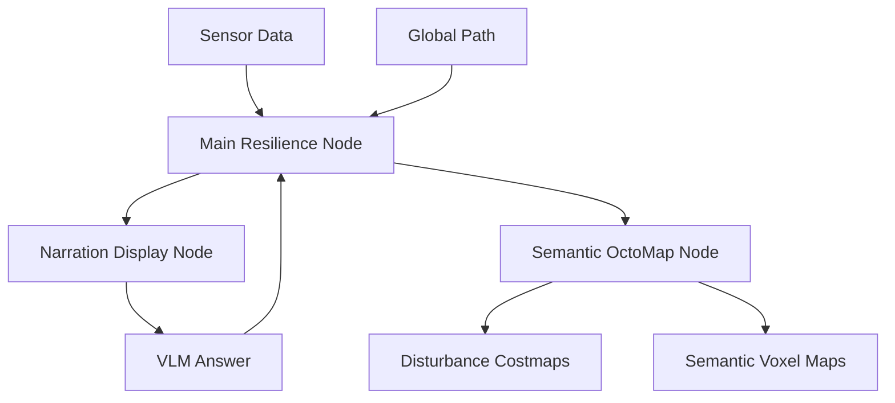

# Resilience System

To understand danger and failures in their true context, it is
crucial to recognise that risks are relative and often depend on
how they impact the goals and capabilities of an individual. As robots increasingly operate in complex, unstructured, and open-world environments, they encounter a vast distribution of dangers that no fixed statistical model or prior knowledge can fully anticipate. Existing methods leveraging semantic reasoning with large vision-language models (VLMs) seek to anticipate hazards but are inherently limited by biases in their training data and often lack the capacity to model real-time, context-dependent hazards unique to each robot and setting. Anticipating such failures in the wild becomes nearly impossible. Inspired by principles of resilience and continual learning, we introduce an experience-driven framework for failure assessment and adaptation by associating these behaviours with semantic elements in the environment using VLMs after a failure has happened to avoid the same or similar failure in the future. Starting with a minimal set of common danger priors, our system dynamically expands a semantic danger library through operational encounters: a fast loop performs real-time anomaly detection and similarity-based retrieval using open-set semantics, while an asynchronous slow loop employs LVLMs for post-hoc analysis modelling semantic Gaussian Processes to predict embodiment-specific effects and behaviour in space. We develop a framework for mapping these dangerous semantics with voxel based mapping and introduce a novel voxel level modelling approach for fine-grained behaviour prediction for interventions. This dual-loop architecture enables efficient, on-edge computation, bridging immediate risk mitigation with long-term knowledge accumulation.

## Quick Start

```bash
# Launch the complete system
ros2 launch resilience resilience.launch.py
```

## System Overview

The Resilience system consists of three core nodes that work together to provide comprehensive drift detection and semantic mapping:

- **Main Resilience Node** - Drift detection, narration generation, and semantic hotspot processing
- **Semantic Depth OctoMap Node** - 3D voxel mapping with semantic labels and disturbance field analysis
- **Narration Display Node** - VLM integration for cause analysis and image processing

## Launch Files

### Primary Launch File
**`launch/resilience.launch.py`** - Launches all three nodes with professional configuration

**Default Configuration:**
- Main resilience node with full feature set
- Semantic depth octomap node with `max_range=1.5m`
- Narration display node with VLM integration


## Configuration Files

### Main Configuration (`config/main_config.yaml`)
Controls the primary resilience node behavior:

```yaml
# Input topics for sensors
topics:
  rgb_topic: "/robot_1/sensors/front_stereo/right/image"
  depth_topic: "/robot_1/sensors/front_stereo/depth/depth_registered"
  pose_topic: "/robot_1/sensors/front_stereo/pose"
  camera_info_topic: "/robot_1/sensors/front_stereo/right/camera_info"

# Output topics for results
  drift_narration_topic: "/drift_narration"
  narration_text_topic: "/narration_text"
  narration_image_topic: "/narration_image"
  vlm_answer_topic: "/vlm_answer"

# Path configuration
path_mode:
  mode: "external_planner"  # or "json_file"
  global_path_topic: "/global_path"
  external_planner:
    timeout_seconds: 30.0
    thresholds:
      soft_threshold: 0.10
      hard_threshold: 0.25

# Segmentation and mapping
segmentation:
  enable_voxel_mapping: true
  prefer_enhanced_embeddings: true
```

### Mapping Configuration (`config/mapping_config.yaml`)
Controls the semantic octomap node:

```yaml
# Input topics for mapping
topics:
  depth_topic: "/robot_1/sensors/front_stereo/depth/depth_registered"
  camera_info_topic: "/robot_1/sensors/front_stereo/left/camera_info"
  pose_topic: "/robot_1/sensors/front_stereo/pose"
  semantic_hotspots_topic: "/semantic_hotspots"

# Output topics for visualization
  semantic_octomap_markers_topic: "/semantic_octomap_markers"
  semantic_octomap_colored_cloud_topic: "/semantic_octomap_colored_cloud"
  semantic_voxels_only_topic: "/semantic_voxels_only"
  semantic_octomap_stats_topic: "/semantic_octomap_stats"
```

## External Path Requirements

### Path Provider Nodes
The system requires a **global path** for drift detection. Two modes are supported:

**1. External Planner Mode (Recommended)**
- Listens to `/global_path` topic for externally provided paths
- Non-blocking startup - begins operation when first path arrives
- Used by: Main resilience node for drift detection

**2. JSON File Mode**
- Loads nominal path from `assets/adjusted_nominal_spline.json`
- Publishes to `/global_path` topic for other consumers
- Used by: Main resilience node for drift detection

### Path Format Requirements
The system expects paths published as `nav_msgs/Path` with:
- **Frame ID**: `map` (FLU convention)
- **Point format**: 3D waypoints with valid x, y, z coordinates
- **Message type**: `geometry_msgs/PoseStamped` array

### Example Path Publisher
Use `scripts/publish_plan.py` as a reference implementation:
```bash
ros2 run resilience publish_plan.py
```

This publishes a proxy plan to `/global_path` topic in the correct format.

## API Key Configuration

### OpenAI API Key Required
The narration display node requires a valid OpenAI API key for VLM (Vision Language Model) integration:

```bash
# Set your OpenAI API key
export OPENAI_API_KEY="your-api-key-here"

# Or add to your shell profile
echo 'export OPENAI_API_KEY="your-api-key-here"' >> ~/.bashrc
source ~/.bashrc
```

**Without the API key:**
- VLM integration will be disabled
- System will log: "No OPENAI_API_KEY found - VLM integration disabled"
- Narration processing will continue without cause analysis

## Input Topics Required

### Sensor Data Topics
The system requires these input topics for full functionality:

| Topic | Type | Description | Default |
|-------|------|-------------|---------|
| `/robot_1/sensors/front_stereo/right/image` | `sensor_msgs/Image` | RGB camera feed | Required |
| `/robot_1/sensors/front_stereo/depth/depth_registered` | `sensor_msgs/Image` | Depth camera feed | Required |
| `/robot_1/sensors/front_stereo/pose` | `geometry_msgs/PoseStamped` | Robot pose | Required |
| `/robot_1/sensors/front_stereo/right/camera_info` | `sensor_msgs/CameraInfo` | Camera intrinsics | Required |

### Path Topic
| Topic | Type | Description | Default |
|-------|------|-------------|---------|
| `/global_path` | `nav_msgs/Path` | Global navigation path | Required for drift detection |

## Published Topics

### Drift Detection and Narration
| Topic | Type | Description |
|-------|------|-------------|
| `/drift_narration` | `std_msgs/String` | Complete drift narration text |
| `/narration_text` | `std_msgs/String` | Narration text only |
| `/narration_image` | `sensor_msgs/Image` | Context image with narration overlay |
| `/vlm_answer` | `std_msgs/String` | AI-determined cause of drift |

### Semantic Mapping and Visualization
| Topic | Type | Description |
|-------|------|-------------|
| `/semantic_octomap_colored_cloud` | `sensor_msgs/PointCloud2` | Colored voxel map (semantic voxels colored by cause) |
| `/semantic_voxels_only` | `sensor_msgs/PointCloud2` | Semantic voxels only (XYZ coordinates) |
| `/semantic_octomap_markers` | `visualization_msgs/MarkerArray` | Voxel markers for RViz visualization |
| `/semantic_octomap_stats` | `std_msgs/String` | Mapping statistics (JSON format) |

### Disturbance Field Analysis
| Topic | Type | Description |
|-------|------|-------------|
| `/gp_field_visualization` | `sensor_msgs/PointCloud2` | **Disturbance field visualization** - Colored point cloud showing disturbance magnitude |
| `/semantic_costmap` | `sensor_msgs/PointCloud2` | **Disturbance costmap** - Raw disturbance values for motion planning |

**Disturbance Costmaps:**
- Published as `PointCloud2` with XYZ coordinates and disturbance magnitude
- Can be visualized in RViz or consumed by motion planning systems
- Values represent learned disturbance field from Gaussian Process fitting
- Use for path planning around identified disturbance sources

## Coordinate Frame Convention

### FLU (Forward-Left-Up) Convention
The entire system uses **FLU convention** for all coordinate frames:

- **X-axis**: Forward direction (positive = forward)
- **Y-axis**: Left direction (positive = left)
- **Z-axis**: Up direction (positive = up)
- **Frame ID**: `map` (configurable via `map_frame` parameter)

### Transform Chain
```
map → base_link → camera_optical_frame
```

All published data (voxels, disturbance fields, costmaps) are in the `map` frame using FLU convention.

## Deployment Examples

### Basic Deployment
```bash
# 1. Set API key
export OPENAI_API_KEY="your-key-here"

# 2. Launch complete system
ros2 launch resilience resilience.launch.py

# 3. Provide sensor data (e.g., rosbag)
ros2 bag play your_data.bag

# 4. Provide global path (if using external planner mode)
ros2 run resilience publish_plan.py
```

### Custom Configuration Deployment
```bash
# Launch with custom parameters
ros2 launch resilience resilience.launch.py \
    max_range:=2.0 \
    voxel_resolution:=0.05 \
    enable_voxel_mapping:=true
```

### Visualization in RViz
```bash
# Add these displays in RViz:
# - PointCloud2: /semantic_octomap_colored_cloud (Color Transformer: RGB)
# - PointCloud2: /gp_field_visualization (Color Transformer: RGB)  
# - PointCloud2: /semantic_costmap (for motion planning)
# - MarkerArray: /semantic_octomap_markers
# - Path: /global_path
```

## Troubleshooting

### Common Issues

**"Path not ready - some functionality may be limited"**
- Ensure `/global_path` topic is being published
- Check path format (must be `nav_msgs/Path`)
- Verify frame ID is `map`

**"No camera intrinsics received"**
- Confirm `CameraInfo` messages on configured topic
- Check camera calibration data

**"VLM integration disabled"**
- Set `OPENAI_API_KEY` environment variable
- Verify API key is valid and has credits

**"No matching depth/pose found for timestamp"**
- Increase `sync_buffer_seconds` in mapping config
- Verify sensor data rates and clock synchronization

### Performance Tuning
- **Voxel resolution**: Lower values (0.05m) for higher detail, higher values (0.2m) for performance
- **Max range**: Limit to 1.5-2.0m for indoor environments
- **Sync buffer**: Increase `sync_buffer_seconds` if experiencing timestamp mismatches

## System Architecture



The system provides a complete pipeline from sensor data to actionable disturbance costmaps, enabling robust path planning and resilience monitoring in dynamic environments.
